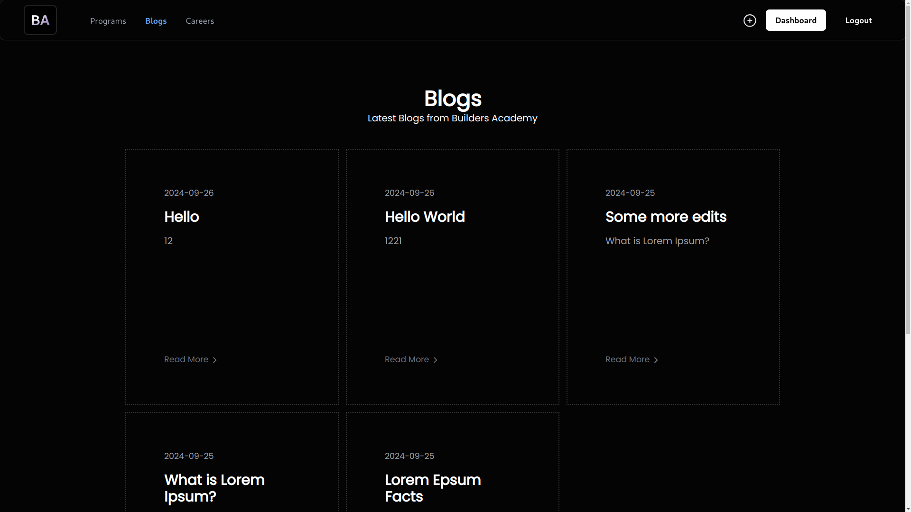
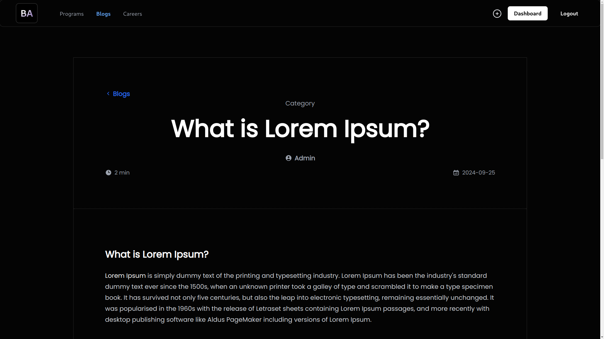
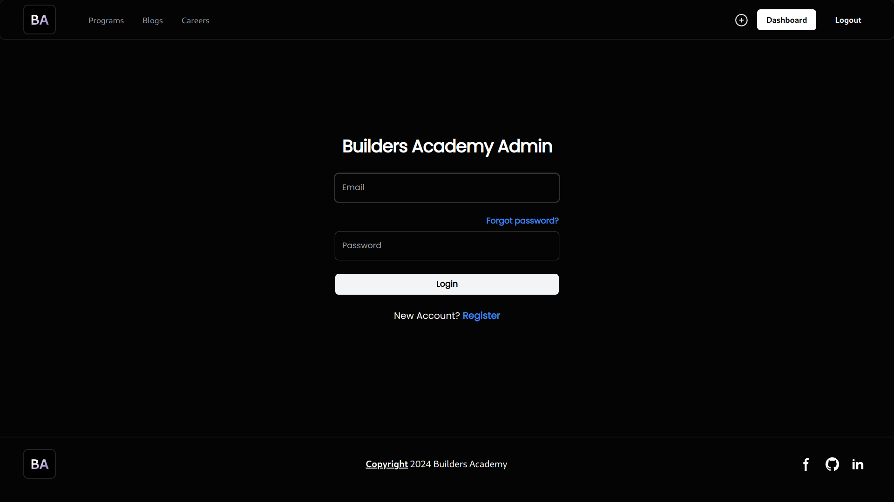
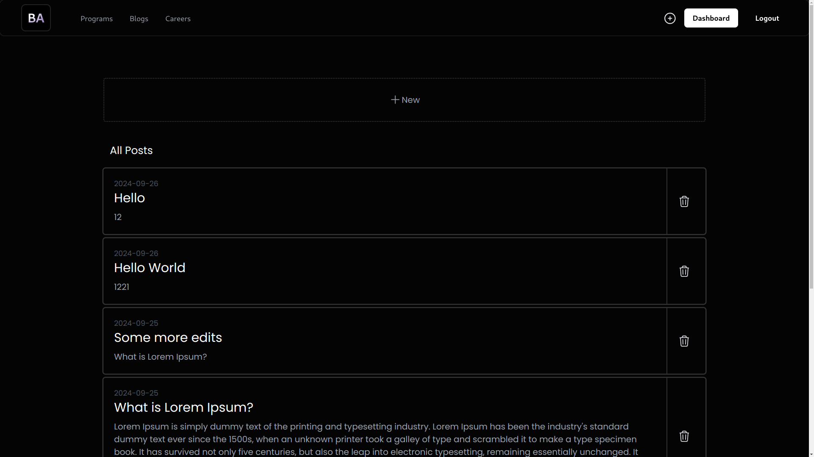
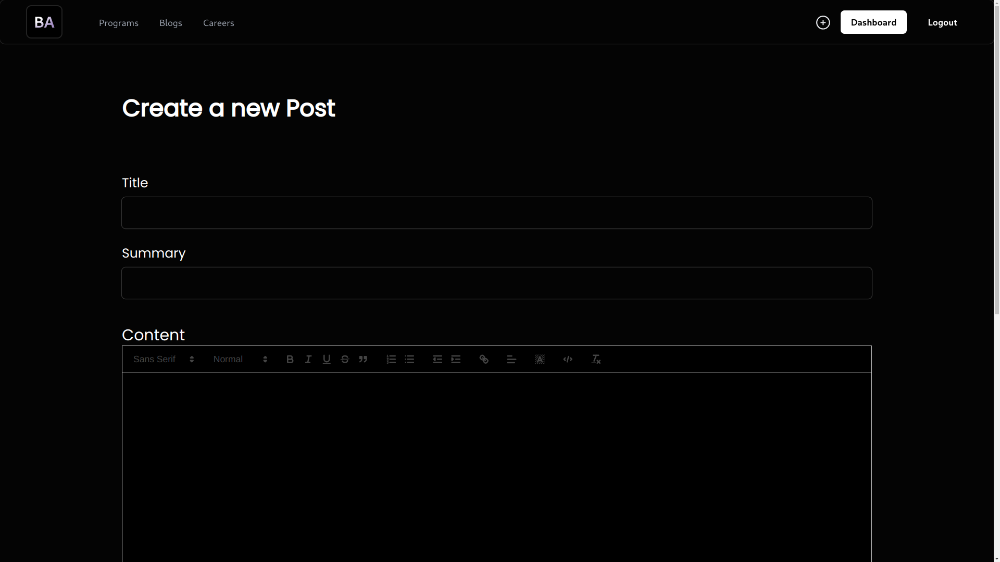

# Builder Academy Blog Function
I implemented the blog functionality for builders academy project.

## Backend

<strong>Stack:</strong>
- ExpressJs
- PostgreSQL

Running back-end locally requires database(PSQL) setup.

## Frontend

<strong>Stack</strong>
- Next.js

## Installation
1. Clone the repo
2. Install required packages for both `frontend/` and `backend/`
3. Create a new `.env` file in `backend/` (copy from `.env.example`)
4. Setup PostgreSQL locally
5. Run `npm run push` on backend to instantiate DB.
6. Run servers for both `frontend/` and `backend/`

  

**To create a new user for admin or login as admin, visit /admin route manually**

## Gallery

**Blogs Page**

**Blog**

**Admin Login**

**Admin Dashboard**

**Creating a new blog**

